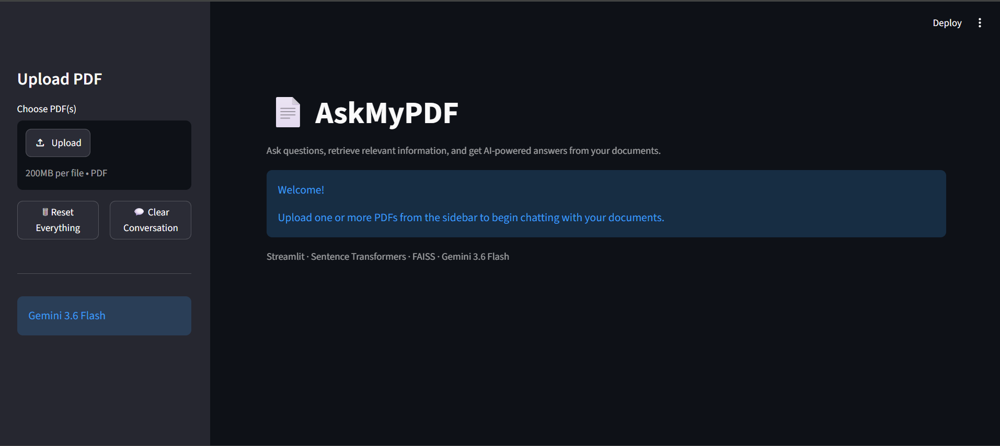
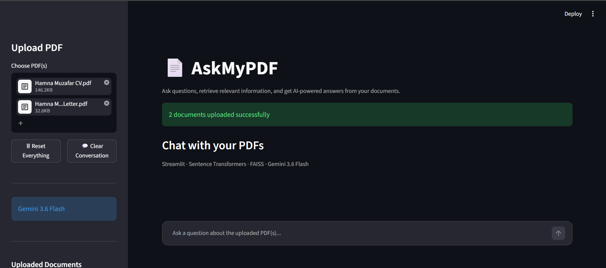
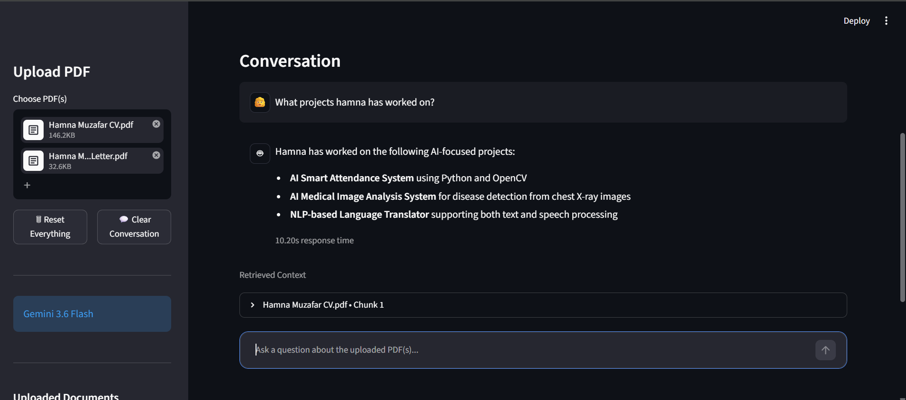
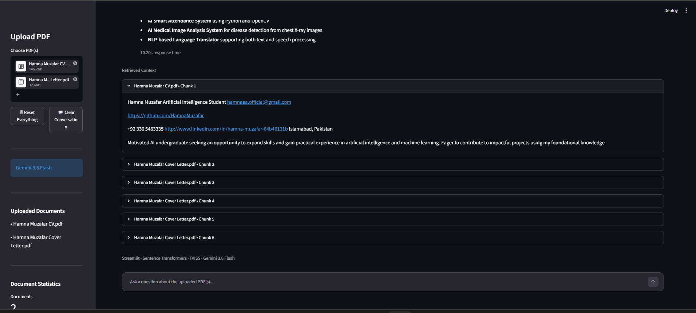

# 📄 AskMyPDF

> Chat with one or multiple PDF documents using AI using **RAG, FAISS, Sentence Transformers, and Gemini 3.6 Flash**.

---

## ✨ Features

- 📄 Upload one or multiple PDF documents
- 🔍 Semantic search with FAISS
- 🤖 AI-powered answers using Gemini 3.6 Flash
- 🧠 Sentence Transformer embeddings
- ✂️ Intelligent text chunking using LangChain
- 💬 Conversation history
- 📊 Document statistics
- ⚡ Response time tracking
- 📚 Multi-document retrieval

---

## 🖼️ Demo

### Home Screen



---

### Multiple PDF Upload



---

### Chat Interface



---

### Retrieved Context



---

## 🏗️ Tech Stack

| Category | Technology |
|-----------|------------|
| Frontend | Streamlit |
| LLM | Gemini 3.6 Flash |
| Embeddings | Sentence Transformers |
| Vector Database | FAISS |
| Framework | LangChain |
| PDF Parser | PyPDF2 |
| Language | Python |

---

## 📂 Project Structure

```text
AskMyPDF/
│
├── app.py
├── requirements.txt
├── README.md
├── LICENSE
├── .gitignore
│
├── utils/
│   ├── pdf_loader.py
│   ├── splitter.py
│   ├── embeddings.py
│   ├── retriever.py
│   └── llm.py
│
└── screenshots/
```

---

## ⚙️ Installation

Clone the repository

```bash
git clone https://github.com/HamnaMuzafar/AskMyPDF.git
```

Move into the project

```bash
cd AskMyPDF
```

Create a virtual environment

```bash
python -m venv .venv
```

Activate it (Windows)

```bash
.venv\Scripts\activate
```

Install dependencies

```bash
pip install -r requirements.txt
```

Create a `.env` file

```env
GOOGLE_API_KEY=YOUR_GOOGLE_API_KEY
```

Run the application

```bash
streamlit run app.py
```

---

## 🔄 Application Workflow

```text
Upload PDF(s)
      │
      ▼
Extract Text
      │
      ▼
Split into Chunks
      │
      ▼
Generate Embeddings
      │
      ▼
Store in FAISS
      │
      ▼
User Question
      │
      ▼
Semantic Search
      │
      ▼
Relevant Chunks
      │
      ▼
Gemini 3.6 Flash
      │
      ▼
Answer
```

---

## 💬 Example Questions

- What is this document about?
- Summarize the uploaded PDFs.
- Where did Hamna intern?
- What is her CGPA?
- Compare the uploaded documents.
- Which document contains internship information?

---

## 🚀 Current Features

- ✅ Single PDF chat
- ✅ Multiple PDF chat
- ✅ Semantic search
- ✅ Context-aware responses
- ✅ Conversation history
- ✅ Retrieved context viewer
- ✅ Response time measurement
- ✅ Document statistics

---

## 🔮 Future Improvements

- Page citations
- OCR support
- Chat memory
- Streaming responses
- Docker support
- Hybrid Search (BM25 + FAISS)
- Persistent vector database
- Authentication

---

## 👩‍💻 Author

**Hamna Muzafar**

Artificial Intelligence Undergraduate

- GitHub: https://github.com/HamnaMuzafar
- LinkedIn: https://www.linkedin.com/in/hamna-muzafar-64b46131b/

---

## 📜 License

This project is licensed under the MIT License.
